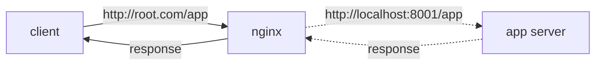
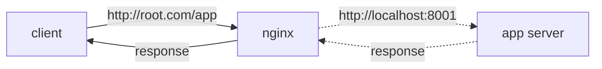

Was just setting up [shiori][1] behind nginx and I wanted it such that
https://prithu.dev/shiori passess the request to port 8001. I have been in this
situation before as well where a path needs to be sent to a another host or application server. 

Just doing the following wont work: 

```nginx
location  /app {
  proxy_pass         http://localhost:8001;
  proxy_set_header   Host $host;
}
```

nginx forwards the client request (`http://root.com/app`) to our app server
(assuming running locally) as `http://localhost:8001/app`, but there is no
route defined as `/app`. Our app expects a request to be sent to `/`. And this
app might just be an api. So the client making a request like
`http://root.com/app/users` would be recieved by the app server as
`http://127.0.0.1/app/users` instead of `http://127.0.0.1/users`. There are two
ways to solve this, though both of the methods are not exactly equivalent, and
other use cases and situations might warrant the use of either of them:

1. Rewrite the URI in nginx
2. Host the app server on `/app` instead of `/`

#### Rewriting URI on nginx

```nginx
location  /app {
  rewrite            /foo/(.*) /$1 break;
  proxy_pass         http://localhost:3200;
  proxy_redirect     off;
  proxy_set_header   Host $host;
}
```

nginx would then send the request to our app server as `http://localhost:8001/`.
So `http://root.com/app/users` would then be `http://127.0.0.1/users` which is
what we want.

**Explaination**: [rewrite][2] directive takes in a regex and replaces it with the
next argument - that is the final URI that will be passed to the app server.
`$1` is the regex capture group refering to `(.*)`

**Before rewrite**: 



**After rewrite**: 



#### Host the app server on `/app` instead of `/`

...Or in other words, let the app server know that the root is `/app/` and not `/`

Most web frameworks have an option for this. `APP_ROOT="/app/"`in the
corresponding framework's equivalent should do the trick. This is what I did for shiori.
Its `serve` command has a `-r` flag that sets the root.

Method 1. is still usefull when the app is somewhat stateless (not the correct
way of using "stateless", but yeah) - i.e it doesn't care where the root is -
it just has to respond to the request and the response is context independent
i.e it doesn't have to refer back to the host - which is mostly the case with
an api. But a webapp where the frontend and backend are closely tied, the app
needs to know what the host is.

**More**

[A good write up about rewrite URI][3]

[1]: https://github.com/go-shiori/shiori
[2]: http://nginx.org/en/docs/http/ngx_http_rewrite_module.html#rewrite
[3]: https://medium.com/rahasak/nginx-reverse-proxy-with-url-rewrite-a3361a35623c

